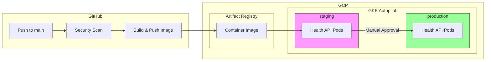

# Health API Infrastructure

Python Flask health API deployed to GKE using Terraform, Helm, and GitHub Actions.

## Architecture



## Project Structure

```
infra/
├── app/                    # Flask application
│   ├── main.py
│   └── requirements.txt
├── terraform/              # GCP infrastructure
│   ├── backend.tf
│   ├── providers.tf
│   ├── variables.tf
│   ├── vpc.tf
│   ├── gke.tf
│   ├── registry.tf
│   ├── iam.tf
│   └── outputs.tf
├── helm/health-api/        # Kubernetes manifests
│   ├── Chart.yaml
│   ├── values.yaml
│   ├── values-staging.yaml
│   ├── values-prod.yaml
│   └── templates/
├── .github/workflows/
│   └── deploy.yml          # CI/CD pipeline
├── Dockerfile
└── RUNBOOK.md
```

## Prerequisites

- GCP project with billing enabled
- `gcloud`, `terraform`, `helm`, `kubectl` installed
- GitHub repo with these secrets/vars configured:
  - `vars.GCP_PROJECT` — GCP project ID
  - `vars.WIF_PROVIDER` — Workload Identity Federation provider
  - `vars.WIF_SERVICE_ACCOUNT` — GCP service account for CI

## Quick Start

### 1. Provision Infrastructure

```bash
cd infra/terraform
terraform init
terraform plan -var="project_id=YOUR_PROJECT_ID"
terraform apply -var="project_id=YOUR_PROJECT_ID"
```

### 2. Build & Run Locally

```bash
cd infra
docker build -t health-api .
docker run -p 8080:8080 health-api
curl http://localhost:8080/health
curl http://localhost:8080/ready
```

### 3. Deploy via CI/CD

Push to `main` to trigger the pipeline:
1. Security scan (Trivy)
2. Docker build & push to Artifact Registry
3. Helm deploy to **staging**
4. Manual approval gate
5. Helm promote to **production**

## Endpoints

| Endpoint  | Method | Description       |
|-----------|--------|-------------------|
| `/health` | GET    | Liveness check    |
| `/ready`  | GET    | Readiness check   |
