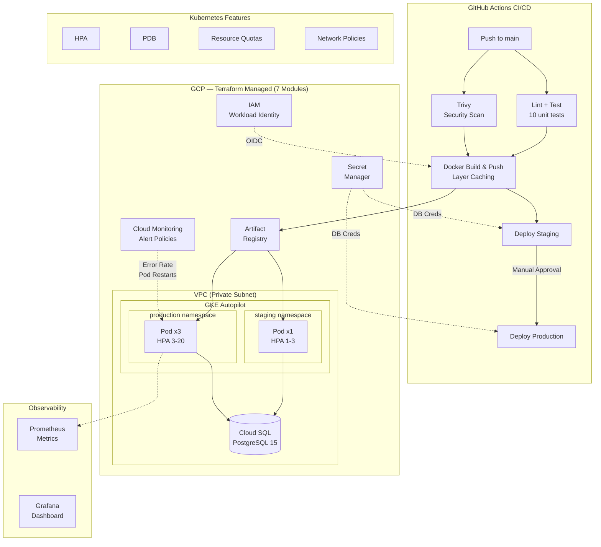

# Health API Infrastructure

Production-grade Python Flask API deployed to GKE with Terraform, Helm, and GitHub Actions CI/CD.

## Architecture



## Project Structure

```
├── app/                           # Flask application
│   ├── main.py                    # API with CRUD, Prometheus metrics
│   ├── requirements.txt
│   ├── requirements-dev.txt
│   └── tests/
│       └── test_api.py            # 10 unit tests
├── terraform/                     # GCP infrastructure (modularized)
│   ├── main.tf                    # Module composition
│   ├── variables.tf / terraform.tfvars
│   ├── providers.tf / backend.tf
│   ├── outputs.tf
│   └── modules/
│       ├── vpc/                   # VPC + private subnet
│       ├── gke/                   # GKE Autopilot cluster
│       ├── registry/              # Artifact Registry
│       ├── iam/                   # Service accounts + roles
│       ├── cloudsql/              # Cloud SQL PostgreSQL
│       ├── secret-manager/        # GCP Secret Manager
│       └── monitoring/            # Alert policies + log metrics
├── helm/health-api/               # Kubernetes manifests
│   ├── Chart.yaml
│   ├── values.yaml                # Base values
│   ├── values-staging.yaml
│   ├── values-prod.yaml
│   └── templates/
│       ├── deployment.yaml        # Zero-downtime rolling update
│       ├── service.yaml
│       ├── hpa.yaml               # Horizontal Pod Autoscaler
│       ├── networkpolicy.yaml     # Ingress/egress rules
│       ├── pdb.yaml               # Pod Disruption Budget
│       ├── resourcequota.yaml     # Namespace resource limits
│       └── secret.yaml            # DB credentials from Secret Manager
├── .github/workflows/
│   ├── deploy.yml                 # CI/CD: lint → test → scan → build → deploy
│   └── infra.yml                  # Terraform: plan on PR → apply on merge
├── grafana/
│   └── dashboard.json             # Grafana dashboard (as code)
├── Dockerfile                     # Multi-stage, non-root, read-only fs
└── RUNBOOK.md
```

## API Endpoints

| Endpoint            | Method | Description                     |
|---------------------|--------|---------------------------------|
| `/health`           | GET    | Liveness check (includes DB)    |
| `/ready`            | GET    | Readiness check                 |
| `/metrics`          | GET    | Prometheus metrics               |
| `/api/runs`         | GET    | List pipeline runs (filterable) |
| `/api/runs`         | POST   | Create a pipeline run           |
| `/api/runs/<id>`    | GET    | Get a single run                |
| `/api/runs/<id>`    | PATCH  | Update run status/duration      |

## Key Design Decisions

- **Workload Identity Federation** — no static JSON keys; OIDC token exchange for CI/CD auth
- **Secret Manager** — DB credentials stored and fetched at deploy time, never in code or Helm values
- **Zero-downtime deploys** — `maxSurge: 1, maxUnavailable: 0` with readiness probes
- **Pod Disruption Budgets** — guarantees availability during node drains and upgrades
- **Resource Quotas** — prevents namespace resource exhaustion across staging/prod
- **Read-only root filesystem** — container security hardening with tmpfs for gunicorn workers
- **Prometheus metrics** — request rate, latency histograms, DB status, pipeline run counters
- **Terraform modules** — reusable, composable infrastructure across environments
- **Docker layer caching** — GitHub Actions cache for faster builds
- **Separate CI/CD pipelines** — app deploys (frequent, low-risk) vs infra changes (infrequent, auditable)

## Prerequisites

- GCP project with billing enabled
- `gcloud`, `terraform`, `helm`, `kubectl` installed
- GitHub repo with vars: `GCP_PROJECT`, `WIF_PROVIDER`, `WIF_SERVICE_ACCOUNT`

## Quick Start

### 1. Provision Infrastructure

```bash
cd terraform
terraform init
terraform plan
terraform apply
```

### 2. Build & Run Locally

```bash
docker build -t health-api .
docker run -p 8080:8080 health-api
curl http://localhost:8080/health
curl http://localhost:8080/ready
```

### 3. Run Tests

```bash
pip install -r app/requirements-dev.txt
python -m pytest app/tests/ -v
flake8 app/ --max-line-length=120 --exclude=app/tests
```

### 4. CI/CD Pipeline

Push to `main` triggers: lint → test → security scan → build → staging → approval → production.
